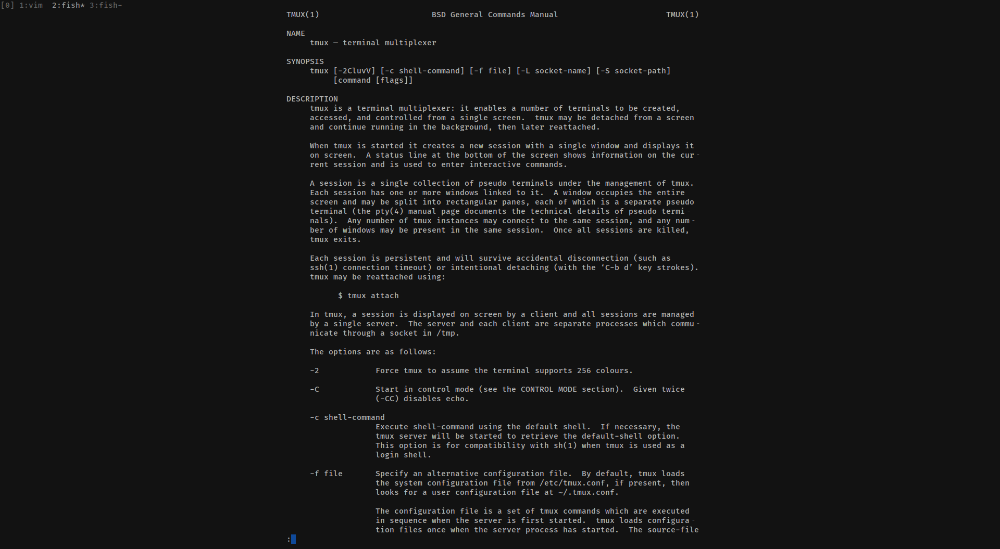
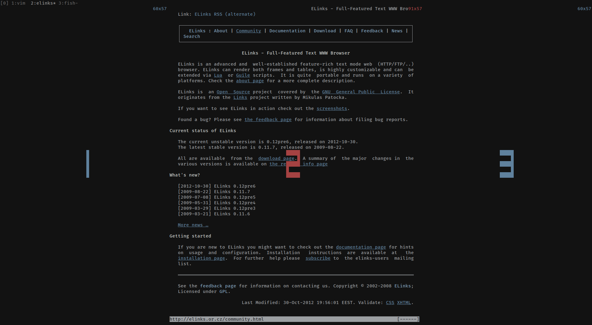

# tmux-concentrate
Get concentrated on readings. 

This plugin is inspired by [goyo.vim](https://github.com/junegunn/goyo.vim). It similarly create paddings to the window, to limit the contents to a narrow page.

## Installation

### Install with [Tmux Plugin Manager](https://github.com/tmux-plugins/tpm) (recommended)

Add plugin to the list of TPM plugins in `.tmux.conf`:

    set -g @plugin 'RedBug312/tmux-concentrate'

Hit <kbd>prefix</kbd>-<kbd>I</kbd> to fetch the plugin and source it.

### Install Manually

Clone the repo:

    $ git clone https://github.com/RedBug312/tmux-concentrate.git ~/clone/path

Add this line to the bottom of `.tmux.conf`:

    run-shell ~/clone/path/concentrate.tmux

Reload TMUX environment:

    # type this in terminal
    $ tmux source-file ~/.tmux.conf

## Configuration

### Toggle Key

Concentrate mode is toggled by <kbd>prefix</kbd>-<kbd>C</kbd> by default. You can set `@concentrate-key` to bind it with another key.

    set -g concentrate-key c

### Background Color

The color will be assigned to `pane-active-border-bg`, `pane-active-border-fg` when concentrate mode is enabled.

The value is same as that of `window-status-current-bg` by default, You can set `@concentrate-bg` to override.

    set -g @concentrate-bg black

### How It Works

This plugin simply create two blank panes on two sides. Noticed that it might fail deabling if you have killed the panes manually before.

When enabled, `@concentrate-enabled` will be set as a tmux-window-option. It might still fail if you set the value manually.

## License

[MIT License](https://github.com/RedBug312/tmux-concentrate/blob/master/LICENSE)
